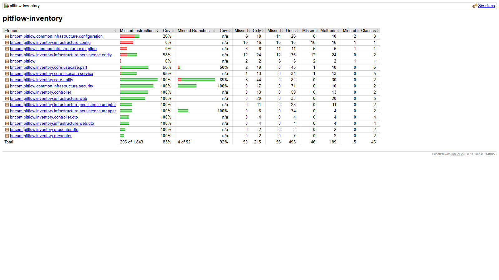

# PitFlow Inventory

Microsserviço responsável pelo catálogo de serviços de oficina e pelo estoque
de peças usado na composição do orçamento das ordens de serviço.

A qualidade do código é acompanhada continuamente pelo SonarQube Cloud.

## Responsabilidade e limites

O Inventory é proprietário de serviços, peças, preços e quantidades de estoque.
Operation consulta esse catálogo pelas APIs; nenhum outro serviço acessa seu
PostgreSQL diretamente.

Clientes e veículos pertencem ao Registry, ordens ao Operation, pagamentos ao
Payment e o estado da SAGA ao Orchestrator.

## Tecnologias

- Java 21 e Spring Boot 4;
- Spring Data JPA e PostgreSQL;
- Liquibase;
- Spring Security/JWT;
- Springdoc OpenAPI;
- Actuator e Datadog;
- Maven, Docker e Kubernetes.

## Arquitetura

```text
core            entidades, portas e casos de uso de peças e serviços
controller      comandos e coordenação da aplicação
presenter       respostas da API
infrastructure  HTTP, segurança, JPA/PostgreSQL e configuração Spring
```

## Pré-requisitos

- JDK 21;
- PostgreSQL 16;
- Maven Wrapper incluído no repositório.

Variáveis:

| Variável | Padrão | Obrigatória |
|---|---|---|
| `DB_HOST` | `localhost` | não |
| `DB_PORT` | `5432` | não |
| `DB_NAME` | `pitflow-inventory-db` | não |
| `DB_USERNAME` | `pitflow_inventory` | não |
| `DB_PASSWORD` | — | sim |
| `JWT_SECRET` | — | sim |
| `DATADOG_ENABLED` | `false` | não |
| `DATADOG_API_KEY` | vazio | somente se Datadog estiver habilitado |

## Execução local

Execução mais simples, com aplicação e PostgreSQL:

```bash
docker compose up --build
```

Endpoints:

- API: `http://localhost:18082/inventory`;
- Swagger: `http://localhost:18082/inventory/swagger-ui/index.html`;
- health: `http://localhost:18082/inventory/actuator/health`.

Para encerrar:

```bash
docker compose down
```

Use `docker compose down -v` somente quando quiser remover também o banco local.

Execução pela JVM:

### Bash

```bash
export DB_PASSWORD="local-password"
export JWT_SECRET="local-jwt-secret-with-at-least-32-bytes"
./mvnw spring-boot:run
```

### PowerShell

```powershell
$env:DB_PASSWORD = "local-password"
$env:JWT_SECRET = "local-jwt-secret-with-at-least-32-bytes"
./mvnw spring-boot:run
```

Build e testes:

```bash
./mvnw -B clean verify
```

## Swagger, OpenAPI e health

- [Swagger publicado](https://85ufbygqvi.execute-api.us-east-1.amazonaws.com/inventory/swagger-ui/index.html)
- [OpenAPI publicado](https://85ufbygqvi.execute-api.us-east-1.amazonaws.com/inventory/v3/api-docs)
- Swagger local: `http://localhost:8080/inventory/swagger-ui/index.html`
- OpenAPI local: `http://localhost:8080/inventory/v3/api-docs`
- Health local: `http://localhost:8080/inventory/actuator/health`

Os links publicados foram validados com HTTP 200 em 27/07/2026.

## Banco e migrations

O serviço utiliza o banco lógico `pitflow-inventory-db`. O Liquibase valida e
evolui o schema no startup. As configurações implantadas são lidas das chaves
`PITFLOW_INVENTORY_DB_*` do secret compartilhado `pitflow/bootstrap`.

## Docker, CI/CD e Kubernetes

```bash
docker build -t pitflow-inventory:local .
```

O workflow independente executa build e testes, publica a imagem
`inventory-<commit-sha>` no ECR e aplica ConfigMap, Secret, Deployment,
ClusterIP Service, Ingress e HPA no namespace `pitflow`.

Com acesso ao cluster:

```bash
kubectl get pods -n pitflow -l app.kubernetes.io/name=pitflow-inventory
kubectl rollout status deployment/pitflow-inventory -n pitflow
kubectl logs -n pitflow deployment/pitflow-inventory --tail=200
```

## Observabilidade

O Actuator expõe `health` e `metrics`. No EKS, métricas, logs e traces são
coletados pelo Datadog configurado na plataforma.

## Qualidade

Execute:

```bash
./mvnw -B clean verify
```

O build executa **68 testes** e aplica `jacoco:check` sobre a cobertura total de
linhas, com mínimo obrigatório de 80%. O relatório HTML é gerado em
`target/site/jacoco/index.html`.

| Métrica JaCoCo | Resultado |
|---|---:|
| Linhas | **88,64%** |
| Instruções | **83,94%** |
| Branches | **92,31%** |

A pipeline publica o relatório e os resultados dos testes no artefato
`inventory-jacoco-<commit-sha>`, retido por 14 dias. O futuro gate do Sonar será
complementar: consumirá o XML do JaCoCo e avaliará também confiabilidade,
segurança, manutenibilidade e duplicação.



## Limites

O Inventory não gerencia clientes, veículos, ordens de serviço, pagamentos ou
estado da SAGA. Alterações de preço/estoque e contratos HTTP devem permanecer
compatíveis com Operation.
